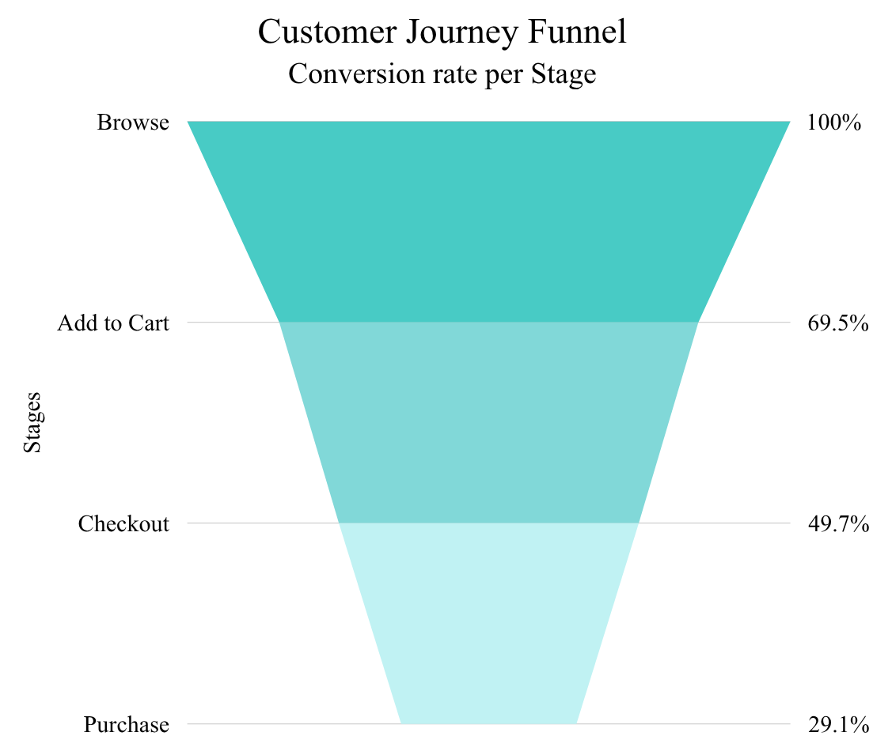

### Funnel Key Findings

- 10.04% of users completed a purchase, meaning roughly 1 in every 10 visitors converted.
- The Checkout → Purchase stage had the highest abandonment rate (70.95%), making it the primary bottleneck in the customer journey.
- Customer drop-off increased at every successive stage, indicating that friction stacks up as users move through the funnel.
- Nearly 9,**000** users were lost before completing a purchase, indicating the largest opportunity for revenue improvement.
- Users who continued through the funnel progressed between stages in approximately 3.5 minutes, suggesting that abandonment—not slow navigation—is the main challenge.
- All recorded revenue ($**277**,**323**.06) was generated exclusively through completed purchases, emphasizing the importance of optimizing the final conversion step.

**TBH**